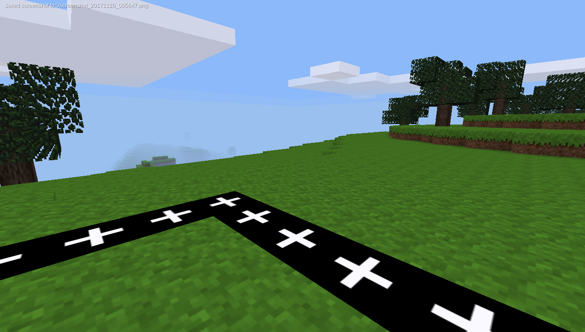

# Jailbox mod for Minetest game
Part of the MinetestEDU modpack.
Enables users with `jailbox` privilege to encapsulate a cubic area (jailbox) of given radius around current users's position. The area is encapsulated by an impenetrable and unbreakable wall. The air nodes of the box are replaced with invisible barrier nodes. All other nodes are replaced with black nodes which emit a small amount of light to be visible at night.

The mod can be utilized to keep students from wandering far away or to enclose them before a race or a contest (as an alternative to just freezing them).

The functions are accessed through:
- `jailbox_set` and `jailbox_unset` chat commands
- GUI buttons provided by `edutest-ui` mod

Limitations:
- Only one jailbox can exist at any time (persistent between sessions)
- Maximum radius capped at 50 (because map chunks must be loaded in memory for `unset` to work properly)

Screenshot:

